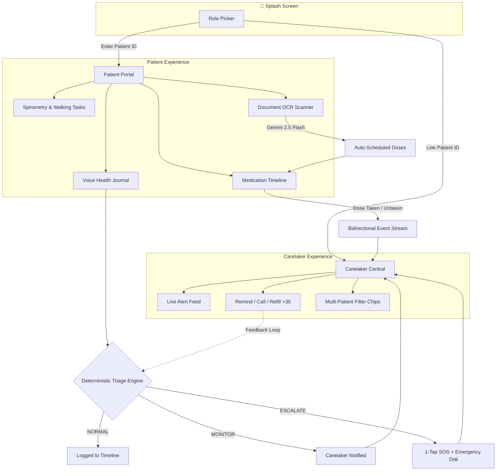

<div align="center">


<div align="center">

# SAATHI (साथी)

### Adaptive, Voice-First Recovery Companion & Caretaker Synchronization Hub

*"Healthcare that adapts to the person, not the other way around."*


</div>

---

## 📋 Table of Contents

- [Overview](#-overview)
- [Key Differentiators](#-key-differentiators)
- [Feature Modules](#-feature-modules)
  - [A. Dual-Role Portal Architecture](#a-dual-role-portal-architecture)
  - [B. Medication Supply & Dosage Engine](#b-medication-supply--dosage-engine)
  - [C. Multimodal Prescription OCR](#c-multimodal-prescription-ocr)
  - [D. Voice-First Health Journal & Triage](#d-voice-first-health-journal--triage)
  - [E. Emergency SOS & Care Circle](#e-emergency-sos--care-circle)
  - [F. Accessibility & Visual Design](#f-accessibility--visual-design)
- [System Architecture](#-system-architecture)
- [Tech Stack](#-tech-stack)
- [API Reference](#-api-reference)
- [Demo Clinical Profiles](#-demo-clinical-profiles)
- [Getting Started](#-getting-started)
- [Deployment](#-deployment)
- [Roadmap](#-roadmap)
- [Safety & Medical Disclaimer](#-safety--medical-disclaimer)
- [Contributing](#-contributing)
- [License](#-license)

---

## 🌟 Overview

Most health apps fail the people who need them most: recovering post-op patients, elders managing visual and cognitive strain, and caregivers juggling remote monitoring on top of everything else. They demand excessive typing, bury critical actions in nested menus, and sound the alarm only *after* something has gone wrong.

**SAATHI** is a deterministic, voice-first clinical recovery engine built for the high-risk **30-day window following hospital discharge**. It combines:

- 📄 Multimodal document comprehension (OCR of prescriptions & discharge summaries)
- 💊 Automated medication inventory depletion tracking
- 🔊 Localized, elder-friendly audio reminders
- 🚨 Deterministic clinical safety guardrails
- 🔄 Real-time synchronization between patients and caretakers

**Brand identity:** obsidian black paired with a warm emerald accent, rendered with cursive handwritten branding for a calm, human feel rather than a clinical one.

---

## 🚀 Key Differentiators

| Dimension | Conventional Health Apps | SAATHI |
|---|---|---|
| **Interface** | Static, rigid, one-size-fits-all UI | **Adaptive Persona Engine** — layouts morph for Elders (high-contrast, voice-first, ≤5 nav buttons, 48px touch targets), Adults, Guardians, and Caretakers |
| **Medication Tracking** | Static checklist; alarms fire without checking stock | **Dosage Inventory Tracker** — tracks total counts and remaining balances, alerts automatically when stock drops below a safe threshold |
| **Caretaker Connection** | Isolated single-user silos or manual phone calls | **Caretaker Central** — multi-patient linking via clinical Patient IDs, live alert feed, dose-confirmation sync, one-click remote refill |
| **Clinical Safety** | Unregulated LLM output or rigid form dropdowns | **Deterministic Clinical Guardrail** — hardcoded rules intercept red flags (chest tightness, dyspnea, post-op warning signs) before any AI synthesis |
| **Document Digitization** | Manual transcription of medication regimens | **Multimodal OCR Extraction** — instantly converts handwritten/printed prescriptions and discharge notes into scheduled dose alerts |
| **Caregiver Alert Fatigue** | Constant noise, notifications get muted | **Closed-Loop Feedback** — caregivers mark alerts non-urgent, tuning backend sensitivity over time |
| **Accessibility** | Harsh white cards or muddy dark modes | **WCAG 2.1 AAA Obsidian Dark Mode** — engineered for post-cardiac recovery, photophobia, and eye strain |

---

## 🛠 Feature Modules

### A. Dual-Role Portal Architecture

- **Splash Screen Role Picker** — one-tap entry into either the Patient Portal or Caretaker Portal, showing the active patient's shareable, copyable clinical **Patient ID** (e.g. `UD827`, `PAT-8492`).
- **Caretaker Central**
  - Multi-patient monitoring hub — link any number of patients by Patient ID.
  - Quick filter chips to isolate alerts per patient or view all connected patients at once.
  - Live alert feed for dose confirmations, untaken-dose reversions, low-supply warnings, and emergency triage events.
  - Remote actions: **Remind Patient**, **Call**, and **Order +30 Refill**.
- **Patient Portal** — personalized daily recovery plan, interactive spirometry and walking tasks, doctor appointments, and a running medication timeline.

### B. Medication Supply & Dosage Engine

- **Inventory Depletion Tracking** — tracks total count, remaining units, and scheduled dose times per medication, shown via color-coded stock progress bars (e.g. 5/30 tablets remaining).
- **Bidirectional Event Stream**
  - Marking a dose *taken* → decrements inventory, logs a timestamp on the timeline, streams a `💊 Dose Confirmed` alert to Caretaker Central.
  - Marking a dose *untaken* → restores inventory, streams a `↩️ Dose Untaken` alert to Caretaker Central.
- **Automated Low-Supply Alarms** — at ≤6 doses remaining, triggers a persistent warning banner, a browser push notification, and an audio chime. Either patient or caretaker can execute a 1-click **+30 Refill**.

### C. Multimodal Prescription OCR

- Camera capture or file upload of paper prescriptions and hospital discharge summaries.
- **Gemini 2.5 Flash** multimodal extraction structures medicines, timings, dosage counts, dietary precautions, and follow-up dates automatically.
- A user verification/review modal precedes committing anything to the live schedule — nothing is auto-applied without confirmation.

### D. Voice-First Health Journal & Triage

- **Hands-Free Speech Engine** — Web Speech API integration supporting Indian English, Hindi, Tamil, and Spanish, with automatic classification into Symptoms, Vitals, Activities, or Daily Updates.
- **Deterministic Triage Safety Engine** — evaluates symptom severity against clinical red flags (chest tightness, shortness of breath, sudden dizziness, etc.) and assigns a level:

  `NORMAL` → `MONITOR` → `ESCALATE`

  On `ESCALATE`, a 1-Tap SOS Quick Alert modal fires and an urgent alert is transmitted to Caretaker Central.

### E. Emergency SOS & Care Circle

- **1-Tap Quick Alert** — pre-fills an emergency SMS with diagnosis, blood group, allergies, and active symptoms, with a direct dialer to the designated emergency contact or 108/112 ambulance services.
- **DPDP Act-Compliant Care Circle** — granular, per-caregiver consent toggles across Medications, Symptoms, Documents, and Emergency Alerts.

### F. Accessibility & Visual Design

- **WCAG 2.1 AAA Obsidian Dark Mode** — a glare-free palette (`#090d16`, `#111827`, `#ffffff`) engineered for photophobia, post-cardiac fatigue, and general eye strain.
- **Elder-Optimized Persona Layout** — 48px minimum touch targets, a simplified bottom nav capped at 5 items, and voice-assisted narration throughout.
- **Multilingual & Regional Inclusivity** — native localization for English, Hindi (हिन्दी), Tamil (தமிழ்), and Spanish (Español), with voice synthesis tuned to 0.92x rate for elderly audibility.

---

## 🏗 System Architecture



---

## 💻 Tech Stack

| Layer | Technology |
|---|---|
| **Frontend** | React 19, TypeScript 5.8, Tailwind CSS v4, Lucide Icons, Recharts, Motion |
| **Backend** | Express.js with Vite SPA middleware (dev); compiled `dist/server.cjs` (production) |
| **AI & ML** | Google GenAI SDK (`@google/genai`), Gemini 2.5 Flash for clinical document synthesis |
| **Voice & Audio** | Web Speech API (STT & TTS), Web Audio API (chime synthesis), Web Notifications API |
| **Runtime / Port** | Node.js ≥ 20, dynamic port via `process.env.PORT \|\| 3000` |
| **Deployment Config** | `railway.json` using the `RAILPACK` builder |

---

## 🔌 API Reference

| Endpoint | Purpose |
|---|---|
| `POST /api/triage-symptom` | Deterministic symptom triage and clinical safety classification |
| `POST /api/extract-rx` | Multimodal Gemini 2.5 prescription & discharge-summary parser |
| `POST /api/voice-health-log` | Classifies voice transcripts into Symptoms / Vitals / Activities / Updates |
| `POST /api/emergency/broadcast` | Audit-logged emergency broadcast to the full Care Circle |
| `POST /api/emergency/quick-alert` | 1-Tap SOS dispatch (pre-filled SMS + dialer) |
| `POST /api/caregiver/feedback` | Closed-loop tuning of alert sensitivity to reduce caregiver fatigue |

> All AI-assisted endpoints fall back to deterministic, offline logic automatically if `GEMINI_API_KEY` is not set.

---

## 🩺 Demo Clinical Profiles

Sample data used for development and testing:

| Patient ID | Age / Sex | Diagnosis | Notes |
|---|---|---|---|
| `UD827` | 54M | Post-Stent Angioplasty (LAD Drug-Eluting Stent), Stage 2 Hypertension, Chronic Mild Gastritis | Regimen: Metformin 500mg, Ecosprin 75mg, Metoprolol Tartrate 25mg, Atorvastatin 20mg, Pantoprazole 40mg. Treating specialist: senior interventional cardiologist. |
| `PAT-8492` | 68M | CABG Bypass Surgery | Post-op Day 5 |
| `PAT-3120` | 36F | Knee Arthroscopy | Recovery phase |
| `PAT-9941` | 7M | Pediatric Asthma | Guardian-verification guardrail enabled |

---

## ⚡ Getting Started

### Prerequisites

- Node.js v20+ or Bun v1.2+
- Git

### Installation

```bash
git clone https://github.com/udbhavnc7/saathi.git
cd saathi
```

```bash
npm install
# or
bun install
```

### Environment Setup

Create a `.env` file in the project root:

```env
PORT=3000
NODE_ENV=development
GEMINI_API_KEY=your_gemini_api_key_here   # Optional — deterministic fallback runs offline if omitted
```

### Run Locally

```bash
npm run dev
```

Then open **http://localhost:3000** in your browser.

### Production Build

```bash
npm run build
npm start
```

---

## ☁️ Deployment

1. **Deploy to Cloud Hosting**
   - **Railway** — connect the GitHub repository `udbhavnc7/saathi`, which is pre-configured with the `RAILPACK` builder. Click **Generate Domain** under Networking to obtain a public URL.
   - **Alternatives** — Render, Fly.io, or AWS App Runner (`npm run build && npm start`).
2. **Set Live Environment Variables**
   - Add `GEMINI_API_KEY` in your cloud provider's dashboard to enable live Gemini vision and NLP. Deterministic offline fallbacks operate automatically if it's omitted.

---

## 🗺 Roadmap

- [ ] **Cloud deployment** — finalize hosting on Railway (or an alternative) with a generated public domain
- [ ] **Live environment variables** — wire up `GEMINI_API_KEY` in the production dashboard
- [ ] **PWA & offline service worker** — add `manifest.json` plus service-worker caching for offline medication alarms and local push notifications without cellular connectivity
- [ ] **WhatsApp / SMS gateway integration** — plug Twilio or Gupshup into `/api/emergency/quick-alert` for automated SMS delivery alongside device-level `sms:` links

---

## 🔒 Safety & Medical Disclaimer

SAATHI is designed as an **assistive communication and recovery management companion**. It does **not** replace professional medical judgment, diagnosis, or emergency dispatch services. All AI-generated output passes through deterministic pharmacology guardrails and requires doctor or patient confirmation before acting on it.

---

## 🤝 Contributing

Contributions, issue reports, and feature suggestions are welcome. Please open an issue to discuss significant changes before submitting a pull request.

---

## 📄 License

No license has been declared for this project yet. Add a `LICENSE` file (e.g. MIT, Apache-2.0) before distributing SAATHI publicly.
