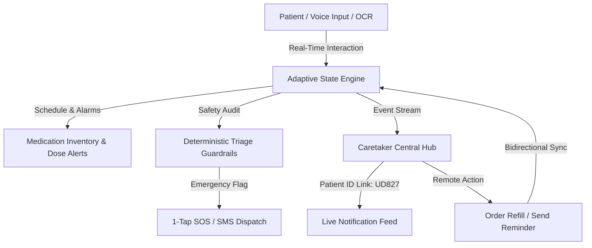

<div align="center">


# SAATHI (साथी)
### Adaptive, Voice-First Recovery Companion & Caretaker Synchronization Hub

*“Healthcare that adapts to the person, not the other way around.”*

[](https://www.typescriptlang.org/)
[](https://react.dev/)
[](https://tailwindcss.com/)
[](https://ai.google.dev/)
[](https://www.w3.org/WAI/standards-guidelines/wcag/)

</div>

---

## 🌟 What is SAATHI?

Most health apps fail the people who need them most: recovering post-op patients, elders dealing with visual and cognitive strain, and frantic caregivers juggling remote monitoring. They demand excessive typing, navigate confusing multi-nested menus, and sound alarms only *after* an emergency occurs.

**SAATHI** is a deterministic, voice-first clinical recovery engine designed for the high-risk 30-day window following hospital discharge. It combines multimodal document comprehension (OCR of prescription receipts and discharge summaries), automated medication inventory depletion tracking, localized audio reminders, deterministic clinical safety guardrails, and real-time synchronization between patients and caretakers.

---

## 🚀 Key Differentiators: How SAATHI is Different

| Feature | Conventional Health Apps | **SAATHI** |
| :--- | :--- | :--- |
| **Interface Architecture** | Static, rigid, one-size-fits-all UI. | **Adaptive Persona Engine**: Morphing layouts for Elders (high-contrast, voice-first, $\le 5$ buttons, 48px touch targets), Adults, Guardians, and Caretakers. |
| **Medication Tracking** | Static checklist; alarms trigger without checking stock. | **Dosage Inventory Tracker**: Automatically tracks total dosage counts, remaining bottle balances, and fires push notifications when stock drops below safety thresholds. |
| **Caretaker Connection** | Isolated single-user silos or manual phone calls. | **Caretaker Central**: Multi-patient linking via clinical Patient IDs (e.g. `UD827`), real-time alert feed, dose confirmation sync, and remote 1-click refill orders. |
| **Clinical Safety** | Unregulated LLM hallucinations or rigid form drop-downs. | **Deterministic Clinical Guardrail**: Hardcoded safety rules that intercept chest tightness, dyspnea, and post-op red flags *before* AI synthesis. |
| **Document Digitization** | Manual transcription of complex medication regimens. | **Multimodal OCR Extraction**: Instant verification of handwritten/printed hospital prescriptions and discharge notes into scheduled dose alerts. |
| **Caregiver Alert Fatigue** | Constant spam causing caregivers to mute notifications. | **Closed-Loop Feedback Loop**: Caregivers can mark alerts non-urgent, adapting backend sensitivity rules to prevent alert fatigue. |
| **Accessibility & Photophobia** | Harsh white cards or muddied dark modes. | **WCAG AAA Obsidian Dark Mode**: Specially engineered high-contrast palette for post-cardiac surgery recovery, migraines, and eye strain. |

---

## 🛠️ Core Capabilities & Feature Modules

### 1. Dual-Role Portal Architecture
- **Patient Portal**: Daily recovery rhythm, interactive spirometry & walking check-ins, medication timeline, and one-tap voice health journal.
- **Caretaker Central**: Multi-patient monitoring hub where family members, nurses, or clinicians link any number of patients via Patient ID (e.g., `UD827`, `PAT-8492`) to observe live medication intake, low-supply alerts, and triage issues.

### 2. Medication Supply & Dose Alert System
- **Total Count & Remaining Balance**: Tracks inventory level (e.g., 5/30 tablets remaining).
- **Automated Dose Sync**: Marking a tablet as taken decrements supply and dispatches an instant `💊 Dose Confirmed` alert to the caretaker. Reverting dispatches a `↩️ Dose Untaken` alert.
- **Push Notification & Audio Chimes**: Web Audio API-synthesized chime alerts and browser notifications when supply hits refill thresholds.
- **1-Click Refill Action**: Caretaker or patient can replenish balances (+30 units) with audit logs persisted to the patient recovery timeline.

### 3. Voice-First Health & Triage Engine
- **Hands-Free Health Logging**: Continuous natural voice transcription using Web Speech API with automatic categorization into Symptoms, Daily Updates, Vitals, or Activities.
- **Emergency Quick Alert (1-Tap SOS)**: Pre-populates emergency SMS and instant phone dialer with clinical diagnosis, blood group, allergies, and current symptoms to designated emergency contacts.

### 4. Multilingual & Regional Inclusivity
- Native localization for English, Hindi (हिन्दी), Tamil (தமிழ்), and Spanish (Español).
- Multilingual voice synthesis tuned to 0.92x rate for elderly audibility.

---

## 🏗️ System Architecture



---

## 💻 Tech Stack

- **Frontend**: React 19, TypeScript, Tailwind CSS v4, Motion, Lucide Icons, Recharts.
- **Backend**: Express.js (Node >= 20), Vite SPA Middleware.
- **AI & ML**: Google GenAI SDK (`@google/genai`), Gemini 2.5 Flash for clinical document synthesis.
- **Audio & System**: Web Speech API (STT & TTS), Web Audio API (chime synthesis), Web Notifications API.

---

## ⚡ Getting Started Locally

### Prerequisites
- Node.js `v20+` or `bun` `v1.2+`
- Git

### Installation

1. **Clone the repository**:
   ```bash
   git clone https://github.com/udbhavnc7/saathi.git
   cd saathi
   ```

2. **Install dependencies**:
   ```bash
   npm install
   # or
   bun install
   ```

3. **Environment Setup**:
   Create a `.env` file in the root directory:
   ```env
   PORT=3000
   NODE_ENV=development
   GEMINI_API_KEY=your_gemini_api_key_here # Optional: deterministic fallback operates offline
   ```

4. **Run the development server**:
   ```bash
   npm run dev
   ```
   Open [http://localhost:3000](http://localhost:3000) in your browser.

5. **Build for Production**:
   ```bash
   npm run build
   npm start
   ```

---

## 🔒 Safety & Medical Disclaimer

SAATHI is designed as an assistive communication and recovery management companion. It does not replace professional medical judgment, diagnosis, or emergency dispatch services. All AI outputs pass through deterministic pharmacology guardrails and require doctor or patient confirmation.
